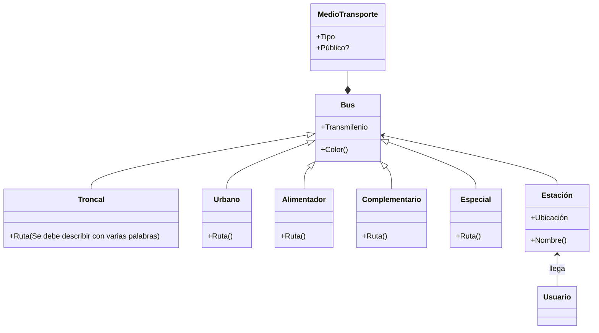

# BautifulDiagram
Elija un problema de la vida real (sistema de gestión de biblioteca, negocio de compra-venta, automóvil, etc) que se pueda modelar a través de objetos y clases. Plantee las relaciones de clases, composiciones, propiedades y comportamientos del sistema en uno mas diagramas tipo UML.
Yo escogí el trasporte masivo.

``
